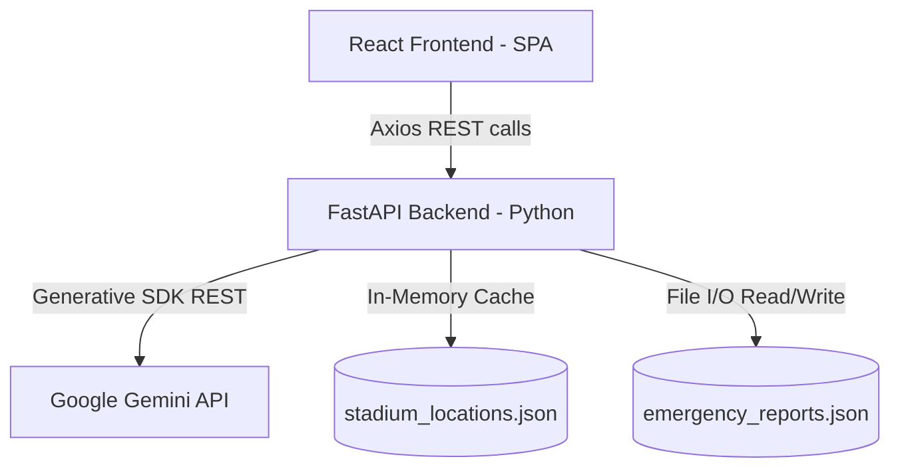

# StadiaFlow AI: Smart Stadium Operations & Wayfinding System

StadiaFlow AI is a production-ready, generative AI-enabled tournament operations dashboard and fan wayfinding assistant designed to enhance the spectator experience and optimize crowd flow management during large-scale sports events such as the FIFA World Cup 2026.

---

## Problem Statement

Large-scale tournament venues face massive operational challenges during peak spectator check-ins. These include entrance gate congestion, concession queue delays, accessible transit bottlenecks, and a lack of unified real-time incident dispatching channels. 

StadiaFlow AI directly addresses these challenges by consolidating simulated IoT telemetries (gate sensors, parking lot capacity, incident logs) into a single operations console and an interactive concourse wayfinding directory powered by Google Gemini AI.

---

## Solution Overview

StadiaFlow AI features:
1. **AI Stadium Assistant**: A chatbot answering fan queries regarding gate locations, wait times, accessible ramps, public transit hubs, and recycling centers. Evaluates queries using Gemini, falling back to a semantic synonym-matching search engine.
2. **Operations Command Console**: An administrative view for dispatchers showing total queue occupancy, average wait times, active emergency dispatch logs, parking availability, and automated Gemini dispatcher advisories.
3. **Interactive Concourse Wayfinding**: A circular concourse SVG map plotting gates, concessions, first aid, and green transit locations, complete with walking time estimations relative to seat sections.

---

## Key Features

- **Semantic Multilingual Search**: Falls back to a local similarity matcher resolving English, Spanish (ES), Portuguese (PT), and French (FR) synonyms to map fan questions accurately.
- **Sustainability Hubs**: Database includes Zero-Waste Sorting stations, Eco-Green water refills, compost zones, and EV charging points.
- **Accessibility Points**: Dedicated filters and markers for wheelchair ramps, companion seats, and sensory support centers.
- **Emergency Dispatch Triage**: Submit incidents through a multi-tier triage form that classifies severity automatically based on dispatch rules.

---

## Challenge Requirement Mapping

StadiaFlow AI aligns directly with the official PromptWars Virtual Challenge 4 requirements:

- **Navigation**: Searchable interactive concourse map displaying section-to-gate walking times.
- **Crowd Management**: Real-time checkpoint tracking, wait times, and gate redirection recommendation insights.
- **Accessibility**: Visual filters and markers for ramps, companion decks, and sensory bags loan centers.
- **Transportation**: Metric cards representing North General Parking, East Shuttle/Bus Transit hub, and West Bicycle valets.
- **Sustainability**: Zero-waste sorting hubs and eco-friendly compostable concessions locations.
- **Emergency Response**: Real-time incident logs and dispatcher dispatch instructions.
- **Generative AI**: Custom instructions formats parsed by Gemini Flash to formulate operational alerts.
- **Multilingual Support**: Simulated synonym matcher resolution maps for multi-language spectator queries.

---

## System Architecture



---

## Tech Stack

### Frontend
- **Framework**: React 19 (Single Page Application)
- **Tooling**: Vite 8 (Build tool)
- **Styling**: Tailwind CSS (v4) & CSS Variables
- **Icons**: Lucide React
- **Router**: React Router 7
- **Tests**: Vitest & React Testing Library (JSDOM)

### Backend
- **Framework**: FastAPI (Python 3.9+)
- **Server**: Uvicorn
- **Validation**: Pydantic v2 (Settings & schemas)
- **Tests**: Pytest & HTTPX TestClient

---

## Project Structure

```
StadiaFlow-AI/
├── backend/                  # FastAPI Python Service
│   ├── app/
│   │   ├── api/endpoints/    # REST Route handlers (chat, dashboard, navigation, stadium)
│   │   ├── core/             # Base configurations settings
│   │   ├── models/           # Pydantic schema validation models
│   │   ├── services/         # Services integrations (Gemini assistant, Dashboard aggregator)
│   │   └── utils/            # Data caches, semantic synonyms matching helpers
│   ├── data/                 # Telemetry databases (stadium, crowd, incidents)
│   ├── tests/                # Automated pytest REST testing suite
│   └── requirements.txt      # Backend Python dependencies
├── frontend/                 # React Web Application
│   ├── src/
│   │   ├── components/       # Reusable layout elements (Header, Footer)
│   │   ├── pages/            # View pages (Landing, Chat, Dashboard, Navigation)
│   │   ├── services/         # API endpoint axios communication service
│   │   └── tests/            # Vitest + RTL components testing suite
│   ├── package.json          # Frontend NodeJS dependencies
│   └── vite.config.js        # Vite configurations
└── docs/                     # Prompts and system design documents
```

---

## Installation & Local Setup

### 1. Backend Setup
1. Navigate to the backend directory:
   ```bash
   cd backend
   ```
2. Create and activate a python virtual environment:
   ```bash
   python -m venv venv
   source venv/bin/activate  # On Windows: venv\Scripts\activate
   ```
3. Install dependencies:
   ```bash
   pip install -r requirements.txt
   ```
4. Copy the example environment file and configure variables:
   ```bash
   cp .env.example .env
   ```
5. Start the FastAPI server:
   ```bash
   python -m uvicorn app.main:app --port 8000 --host 127.0.0.1 --reload
   ```

### 2. Frontend Setup
1. Navigate to the frontend directory:
   ```bash
   cd ../frontend
   ```
2. Install NodeJS packages:
   ```bash
   npm install
   ```
3. Copy the example environment file and configure variables:
   ```bash
   cp .env.example .env
   ```
4. Launch the local Vite development server:
   ```bash
   npm run dev
   ```

---

## Environment Variables

### Backend (`backend/.env`)
- `GEMINI_API_KEY`: Google AI Studio Gemini API key. Falls back to simulated engine if empty.
- `GEMINI_MODEL_NAME`: Target model (defaults to `gemini-1.5-flash`).
- `ALLOWED_ORIGINS`: Comma-separated list of permitted CORS origins.

### Frontend (`frontend/.env`)
- `VITE_API_URL`: Root target FastAPI endpoint (e.g. `http://localhost:8000/api`).

---

## API Endpoints

| Method | Route | Description |
| :--- | :--- | :--- |
| **GET** | `/api/health` | API service status checks. |
| **POST** | `/api/chat` | Queries the AI Stadium Assistant. |
| **GET** | `/api/dashboard` | Compiles crowd, parking, and incident metrics. |
| **GET** | `/api/navigation` | Resolves concourse directories and walk times. |
| **GET** | `/api/v1/stadium/locations` | Fetches static amenities and stadium locations. |
| **GET** | `/api/v1/crowd/status` | Fetches check-in flow metrics. |
| **GET** | `/api/v1/emergency/reports` | Fetches current dispatch incident reports log. |
| **POST** | `/api/v1/emergency/reports` | Submits a new incident report to dispatch. |

---

## Testing

StadiaFlow AI contains unit and integration tests for both client and API services.

- **Backend Pytest**: Runs integration assertions for health, navigation waypoints, dashboard metrics aggregates, and chat query sizes:
  ```bash
  pytest backend/tests/
  ```
- **Frontend Vitest**: Renders layout structures, components visibility, and search forms inside a JSDOM mockup:
  ```bash
  npm run test
  ```

---

## Security & Reliability

- **HTTP Security Headers**: Middleware appends clickjacking defense, content sniffing prevention, and scripting protection headers to all server responses:
  - `X-Frame-Options: DENY`
  - `X-Content-Type-Options: nosniff`
  - `X-XSS-Protection: 1; mode=block`
  - `Referrer-Policy: strict-origin-when-cross-origin`
- **Request Boundaries Constraints**: incoming API payloads are checked against Pydantic validation rules.
- **Failover Mode**: If the Gemini API key is missing or calls fail, the backend seamlessly routes questions to the local similarity matching search engine.

---

## Performance Optimizations

- **Static JSON Memory Cache**: Reads and parses `stadium_locations.json` into a global memory cache during startup, reducing subsequent disk read queries to zero.

---

## Accessibility

- **Keyboard Selectors**: Circular SVG Concourse map sectors support `tabIndex="0"` focus and `Enter`/`Space` key triggers.
- **Form Association Mappings**: Inputs and description textareas inside forms are mapped to `htmlFor` tags.
- **Descriptive Identifiers**: Custom `aria-label` definitions are attached to search fields, buttons, and graphics.
- **Outline Focus State styles**: High-contrast outline focuses are attached to text elements for low-vision navigation.

---

## Future Enhancements

- **Real-Time WebSockets**: Establish direct WebSocket pipelines for active telemetry streams instead of polling intervals.
- **Shortest Path routing overlay**: Implement Dijkstra's algorithm over concourse nodes to overlay navigation paths directly onto the SVG map.
