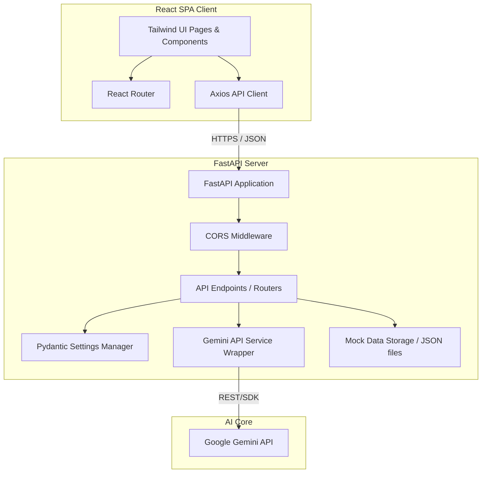

# System Architecture - StadiumPilot AI

This document details the system architecture and technical layout of StadiumPilot AI, a smart stadium assistant designed for the FIFA World Cup 2026.

---

## 1. High-Level Architecture Diagram

---

## 2. Component Descriptions

### Frontend Client (React)
- **Vite**: Modern front-end build tool configured with React and hot module replacement (HMR).
- **Tailwind CSS (v4)**: Modern CSS configuration for rapid design, animations, and high-fidelity aesthetics.
- **React Router**: Manages client-side page routing (Landing Page, AI Assistant Chat, Crowd Status Dashboard, Emergency incident list).
- **Axios**: Standardized client for performing async HTTP requests. Configured with a central base URL, headers, and request interceptors.

### Backend Server (FastAPI)
- **FastAPI Core**: Lightweight and highly performant Python framework utilizing ASGI for asynchronous requests.
- **Settings (Pydantic-Settings)**: Centralized configuration parsing settings from backend `.env` file, ensuring type safety.
- **CORS Middleware**: Standard FastAPI security middleware configured to restrict/allow origins mapping to the frontend local/production URLs.
- **Modular Routing**: Uses `APIRouter` instances dynamically grouped under prefix `/api/v1` for future-proof API versioning.
- **Data Store (Simulated)**: A read-write JSON data loader which acts as a simulated database during MVP. Designed to be swapped with SQLAlchemy (PostgreSQL) or MongoDB.
- **Gemini AI Service**: Encapsulated service wrapper using the `google-generativeai` SDK. Implements token limits, request handling, structured prompts, and error recovery.

---

## 3. Data Flow Scenarios

### Scenario A: Fan asking a question to the AI Assistant
1. User enters a query (e.g., "Where is Gate 4 relative to Section 102?") in the React UI.
2. Axios posts the prompt payload to `/api/v1/gemini/assistant`.
3. The backend router retrieves the request, invokes the Gemini Service.
4. Gemini Service loads custom contextual prompts from `docs/prompts.md` and appends stadium details from `stadium_locations.json`.
5. The processed prompt is sent to Google's Gemini model.
6. The model's markdown/text response is returned via FastAPI to the React client, which renders it elegantly.

### Scenario B: Monitoring crowd density at checkpoints
1. Stadium operations views the Crowd Status dashboard.
2. React client triggers periodic polling or page-load fetch to `/api/v1/crowd/status`.
3. FastAPI backend loads `crowd_status.json`, runs aggregations (e.g. average wait times), and returns JSON payload.
4. UI displays wait times and highlights high-congestion checkpoints in yellow/red colors.
